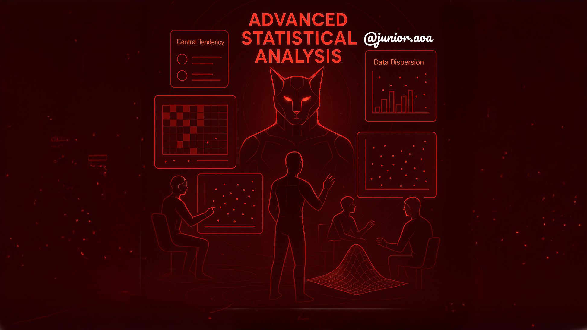

# 📘 Análisis Estadístico Avanzado



Este repositorio contiene ejercicios y notebooks para aprender fundamentos de estadística descriptiva, exploración de datos, análisis bivariado, detección de outliers y transformaciones avanzadas de datos. Está dividido en cuatro secciones completas que te llevarán desde conceptos básicos hasta técnicas avanzadas de Feature Engineering.

---

## 1. FUNDAMENTOS Y EXPLORACIÓN INICIAL

> **Objetivo:** Comprender y calcular medidas básicas de tendencia central, dispersión y distribución de datos.

### Contenido de esta sección

1. 📊 **Repaso de conceptos básicos:**
   * Media, mediana, varianza y desviación estándar
   * Asimetría (skewness) y curtosis
   * Percentiles y cuartiles

2. 🛠️ **Ejercicio práctico:**
   * Análisis estadístico completo de un dataset financiero con Python
   * Visualizaciones avanzadas de distribuciones

### Notebook asociado

* **`1_FundamentoExploracionKurtosis.ipynb`**
  * Importación de librerías necesarias (`pandas`, `numpy`, `seaborn`, `matplotlib`, `scipy.stats`)
  * Carga y limpieza de datos (llenado de valores nulos)
  * Cálculo de estadística descriptiva con `df.describe()` y funciones manuales
  * Función reutilizable `analizar_columna()` para obtener media, mediana, moda, desvío, varianza, percentiles, asimetría y curtosis
  * Visualizaciones: histogramas, KDE, boxplots, Q-Q plots

**Duración estimada:** 3 horas

---

## 2. ANÁLISIS BIVARIADO COMPLETO

> **Objetivo:** Explorar relaciones entre dos variables mediante técnicas numéricas y gráficas.

### Contenido de esta sección

1. 🔢 **Correlación de Pearson:**
   * Matriz de correlación para variables numéricas
   * Heatmap con anotaciones y un decimal

2. 🔄 **Correlación de Spearman:**
   * Alternativa para relaciones no lineales

3. 📊 **Pruebas de Chi-cuadrado:**
   * Tabla de contingencia (`pd.crosstab`)
   * Cálculo de chi-cuadrado con `scipy.stats.chi2_contingency`
   * Interpretación de valores observados vs. esperados y p-value

4. 📈 **Gráficos de dispersión con líneas de regresión:**
   * Scatter plots con `matplotlib`
   * Ajuste de recta (regresión lineal) con `np.polyfit`

5. 🧮 **ANOVA de dos vías:**
   * Comparar grupos (`Fare` vs. `Sex` y `Survived`)
   * Uso de `pingouin.anova()` para efectos principales e interacción
   * Interpretación de F, p-value y eta-cuadrado parcial

### Notebooks y archivos

* **`2_AnalisisBivariado.ipynb`** *(crear)*
  * Código para **Pearson** y **Spearman**, gráficos de heatmap
  * Ejemplos de `countplot`, `crosstab` + heatmap
  * Cálculos de chi-cuadrado y tablas de frecuencia en porcentajes
  * Scatter + línea de regresión y explicación de pendiente
  * ANOVA de dos vías con `pingouin` y gráficos de interacción (opcional)

**Duración estimada:** 4 horas

---

## 3. DETECCIÓN Y TRATAMIENTO DE OUTLIERS

> **Objetivo:** Identificar, analizar y tratar valores atípicos que pueden distorsionar el análisis y los modelos de machine learning.

### Contenido de esta sección

1. 🕵️ **Detección de Outliers con Z-Score:**
   * Cálculo del Z-Score para identificar valores extremos
   * Umbral de 1.96 y 2.0 para clasificación de outliers
   * Visualización de outliers en scatter plots

2. 📏 **Método del Rango Intercuartílico (IQR):**
   * Cálculo de Q1, Q3 y IQR
   * Límites inferior y superior (Q1 - 1.5*IQR, Q3 + 1.5*IQR)
   * Identificación visual con boxplots

3. ✂️ **Técnicas de Eliminación:**
   * Función automatizada `eliminar_atipicos()` 
   * Iteraciones múltiples para refinamiento
   * Comparación antes/después con visualizaciones

4. 🎯 **Winsorización:**
   * Técnica de recorte de percentiles extremos
   * Uso de `scipy.stats.mstats.winsorize`
   * Preservación de datos vs. eliminación completa

5. 💥 **Impacto en Modelos:**
   * Efectos en correlaciones y regresiones
   * Distorsión de predicciones
   * Mejores prácticas para el tratamiento

### Notebook asociado

* **`3_Deteccion_Tratamiento_Outliers.ipynb`**
  * Análisis con datasets de Iris, Titanic y Airbnb
  * Implementación de Z-Score con `np.abs()` y `scipy.stats.zscore()`
  * Cálculo manual e iterativo del método IQR
  * Transformaciones logarítmicas para reducir outliers
  * Comparaciones visuales con `seaborn` boxplots e histogramas
  * Winsorización con límites del 5% superior e inferior

**Duración estimada:** 4 horas

---

## 4. TRANSFORMACIONES PARA FEATURE ENGINEERING

> **Objetivo:** Dominar técnicas avanzadas de transformación de variables para optimizar el rendimiento de modelos de machine learning.

### Contenido de esta sección

1. 🌳 **Transformaciones Logarítmicas:**
   * Logaritmo natural (`np.log`), base 10 (`np.log10`) y base 2 (`np.log2`)
   * Reducción de asimetría y outliers
   * Mejora en modelos de regresión

2. 🌱 **Transformaciones de Raíz Cuadrada:**
   * Uso de `np.sqrt()` para suavizar distribuciones
   * Alternativa más suave que logaritmos
   * Manejo de valores cero y positivos

3. ✨ **Transformaciones Box-Cox:**
   * Búsqueda automática del parámetro lambda óptimo
   * Uso de `scipy.stats.boxcox`
   * Normalización hacia distribución gaussiana

4. ⚖️ **Normalización y Estandarización:**
   * **MinMaxScaler:** Escalado entre 0 y 1
   * **StandardScaler:** Media 0 y desviación estándar 1
   * **RobustScaler:** Resistente a outliers usando mediana e IQR
   * **Normalizer:** Normalización por norma de vector

5. 📊 **Comparación Visual:**
   * Histogramas antes/después de transformaciones
   * Gráficos de series temporales
   * Métricas de asimetría (skewness)

### Notebook asociado

* **`4_Transformaciones_Feature_Engineering.ipynb`**
  * Datasets de Airbnb, retrasos de aerolíneas y redes sociales
  * Implementación con `sklearn.preprocessing`
  * Visualizaciones interactivas con `plotly.express`
  * Función personalizada `plotting()` para análisis temporal
  * Comparaciones cuantitativas de distribuciones

**Duración estimada:** 5 horas

---

## 🚀 Cómo comenzar

1. **Clonar el repositorio:**
   ```bash
   git clone https://github.com/junortiz/Feature_Engineering_Avanzado.git
   cd Feature_Engineering_Avanzado
   ```

2. **Crear y activar un entorno virtual (recomendado):**
   ```bash
   python -m venv venv
   source venv/bin/activate  # Linux/macOS
   venv\Scripts\activate     # Windows
   ```

3. **Instalar dependencias:**
   ```bash
   pip install -r requirements.txt
   ```

4. **Abrir los notebooks en Jupyter:**
   ```bash
   jupyter notebook
   ```

---

## 📋 Dependencias Principales

```txt
pandas>=1.3.0
numpy>=1.21.0
matplotlib>=3.4.0
seaborn>=0.11.0
scipy>=1.7.0
scikit-learn>=1.0.0
plotly>=5.0.0
pingouin>=0.5.0
```

---

## 📚 Estructura del Proyecto

```
Feature_Engineering_Avanzado/
│
├── notebooks/
│   ├── 1_FundamentoExploracionKurtosis.ipynb
│   ├── 2_AnalisisBivariado.ipynb
│   ├── 3_Deteccion_Tratamiento_Outliers.ipynb
│   └── 4_Transformaciones_Feature_Engineering.ipynb
│
├── data/
│   ├── Dia3_Titanic.csv
│   ├── Dia4_Iris.csv
│   ├── Dia4_Airbnb_Open_Data.csv
│   ├── Dia5_Airline_daley.csv
│   └── Dia5_Time_social_media.csv
│
├── images/
│   └── Banner.png
│
├── requirements.txt
├── LICENSE
└── README.md
```

---

## 🎯 Objetivos de Aprendizaje

Al completar este repositorio, serás capaz de:

✅ **Analizar** distribuciones de datos con métricas estadísticas avanzadas  
✅ **Detectar** relaciones entre variables usando correlaciones y pruebas estadísticas  
✅ **Identificar** y tratar outliers de manera efectiva  
✅ **Transformar** variables para optimizar modelos de machine learning  
✅ **Visualizar** datos de manera efectiva para comunicar insights  
✅ **Preparar** datasets para algoritmos de inteligencia artificial  

---

## 🤝 Contribuciones

Las contribuciones son bienvenidas. Por favor:

1. Fork el proyecto
2. Crea una rama para tu feature (`git checkout -b feature/nueva-funcionalidad`)
3. Commit tus cambios (`git commit -m 'Agregar nueva funcionalidad'`)
4. Push a la rama (`git push origin feature/nueva-funcionalidad`)
5. Abre un Pull Request

---

## 📄 Licencia

Este proyecto está bajo la licencia MIT. Consulta el archivo `LICENSE` para más detalles.

---

## 📞 Contacto

Si tienes preguntas o sugerencias, no dudes en:
- Abrir un [Issue](https://github.com/junortiz/Feature_Engineering_Avanzado/issues)
- Contactarme en [LinkedIn](https://linkedin.com/in/junortiz)

---

*El niño curioso ha preparado estos notebooks con explicaciones sencillas y ejemplos prácticos para aprender estadística y análisis de datos paso a paso. ¡Cada sección incluye ejercicios prácticos con datasets reales y código comentado para facilitar el aprendizaje!* 🚀✨