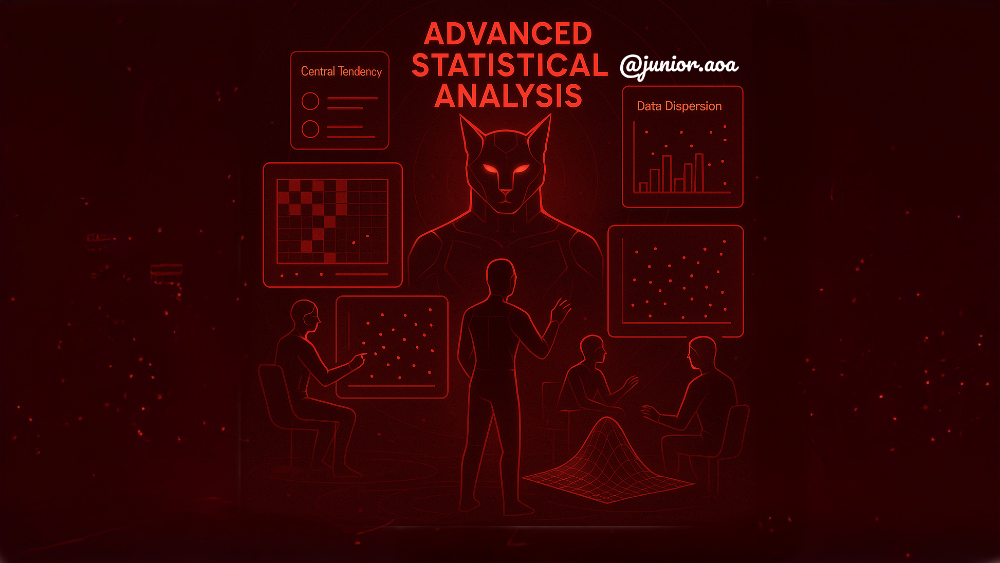

# 📘 Análisis Estadístico Avanzado



## 🎯 ¿De qué trata este Repositorio?

Imagina que los datos son como un cofre del tesoro lleno de pistas. Este repositorio te enseñará a:

1.  **🕵️‍♂️ Analizar Estadísticamente los Datos:**
    * Aprenderás a "interrogar" tus datos para entender qué historia cuentan.
    * Calcularás cosas como promedios, cómo se dispersan los datos y qué forma tienen (simetría, curtosis).
    * Verás si los datos siguen un patrón "normal" o si hay sorpresas.

2.  **🛠️ Preparar tus Datos (Ingeniería de Características - Feature Engineering):**
    * A veces, los datos no están listos para usarse. Aprenderás a "limpiarlos" y "transformarlos".
    * Descubrirás cómo encontrar y manejar datos "raros" o "atípicos" (outliers).
    * Convertirás datos en formatos más útiles para que los modelos de predicción funcionen mejor.
    * Seleccionarás las piezas de información (variables) más importantes.

En resumen, te daremos las herramientas y ejemplos prácticos para que puedas aplicar estas técnicas en tus propios proyectos. ¡No importa si eres estudiante, analista o simplemente alguien con curiosidad por los datos!

---

## 🗺️ Tu Hoja de Ruta: Contenido del Repositorio

Hemos organizado el aprendizaje en varios cuadernos (notebooks) de Jupyter. Cada uno es un paso en tu viaje:

### 📚 Los Cuadernos (Notebooks `.ipynb`):

1.  **`1_Fundamentos_Exploracion_Kurtosis.ipynb`**:
    * **Objetivo Simple:** Tus primeros pasos. Aprende a cargar datos, obtener estadísticas básicas (como el promedio), y entender la "forma" y "personalidad" de tus datos (asimetría y curtosis).
2.  **`2_Correlacion_Entre_Variables.ipynb`**:
    * **Objetivo Simple:** Descubre si tus datos "se llevan bien" entre sí. ¿Cuando una variable cambia, otra también lo hace? Veremos cómo medir estas relaciones.
3.  **`3_Deteccion_Tratamiento_Outliers.ipynb`**:
    * **Objetivo Simple:** ¡Cuidado con los datos extraños! Aprende a encontrar y manejar esos valores "atípicos" (outliers) que pueden distorsionar tus análisis.
4.  **`4_Transformaciones_Feature_Engineering.ipynb`**:
    * **Objetivo Simple:** Prepara tus datos para el éxito. Transforma tus variables (escalado, normalización) para que los modelos de machine learning los entiendan mejor.
5.  **`5_Seleccion_variables.ipynb`**:
    * **Objetivo Simple:** Elige a los "jugadores estrella". Aprende a seleccionar las variables más importantes para tus análisis y modelos, descartando el ruido.

### 💾 Los Datos de Ejemplo (Datasets `.csv`):

Para que puedas practicar, incluimos estos archivos de datos:
* `Dia3_Titanic.csv` (usado para ejemplos de outliers y selección de variables)
* `Dia4_Airbnb_Open_Data.csv` (usado para transformaciones y reducción de dimensionalidad)
* `Dia6_AB_data.csv` (usado para pruebas A/B)
* `Dia6_Phone_usage_india.csv` (usado para análisis de asociación entre categorías)

*(Nota: El archivo `Dia3_Titanic.csv` aparece dos veces en tu estructura original, he listado solo uno aquí, pero asegúrate de que tus notebooks apunten al correcto si son diferentes).*

### 📂 Estructura General:

```

📦 .
├── 1\_Fundamentos\_Exploracion\_Kurtosis.ipynb
├── 2\_Correlacion\_Entre\_Variables.ipynb
├── 3\_Deteccion\_Tratamiento\_Outliers.ipynb
├── 4\_Transformaciones\_Feature\_Engineering.ipynb
├── 5\_Seleccion\_variables.ipynb
├── Dia6\_AB\_data.csv
├── Dia6\_Phone\_usage\_india.csv
├── Dia3\_Titanic.csv
├── Dia4\_Airbnb\_Open\_Data.csv
├── Dia3\_Titanic.csv
├── README.md
├── LICENSE
└── (otros archivos o imágenes complementarias)

````

## 🚀 ¡Empecemos! Guía Rápida

Sigue estos pasos para poner todo en marcha en tu computadora:

**1. Requisitos Previos (Lo que necesitas):**
* **Python:** Versión 3.7 o más reciente.
* **Jupyter Notebook** o **JupyterLab:** Para abrir y ejecutar los cuadernos.
* **Librerías de Python:**
    * `pandas` (para manejar datos en tablas)
    * `numpy` (para cálculos numéricos)
    * `matplotlib` (para gráficos básicos)
    * `seaborn` (para gráficos estadísticos más bonitos)
    * `scipy` (para funciones científicas y estadísticas)
    * `scikit-learn` (para machine learning y preprocesamiento)

**2. Instalación:**

* **Clona este repositorio:**
    Abre tu terminal o consola y escribe:
    ```bash
    git clone [https://github.com/junortiz/Feature_Engineering_Avanzado.git](https://github.com/junortiz/Feature_Engineering_Avanzado.git)
    cd análisis-estadístico-avanzado
    ```
* **Instala las librerías:**
    Si usas `pip`:
    ```bash
    pip install pandas numpy matplotlib seaborn scipy scikit-learn jupyter
    ```
    Si usas `conda`:
    ```bash
    conda install pandas numpy matplotlib seaborn scipy scikit-learn jupyter
    ```

**3. Ejecuta los Notebooks:**

* **Inicia Jupyter:**
    En tu terminal, dentro de la carpeta del proyecto, escribe:
    ```bash
    jupyter notebook
    ```
    o si prefieres JupyterLab:
    ```bash
    jupyter lab
    ```
* **Abre y explora:**
    Se abrirá una pestaña en tu navegador. ¡Haz clic en el primer notebook (`1_Fundamentos_Exploracion_Kurtosis.ipynb`) y comienza tu aprendizaje! Ejecuta las celdas en orden.
* **Archivos de datos:**
    Asegúrate de que los archivos `.csv` estén en la misma carpeta que los notebooks para que se carguen correctamente.

---

## 💡 ¿Cómo se detalla cada Notebook?

Aquí un resumen más técnico de lo que encontrarás en cada uno:

<details>
<summary><strong>1. Fundamentos y Exploración Inicial</strong> (Haz clic para expandir)</summary>

* **Objetivo Principal:** Entender la exploración básica de datos, calcular estadísticas esenciales (media, mediana, varianza), y profundizar en asimetría y curtosis.
* **Temas Cubiertos:**
    * Importación de librerías.
    * Lectura y limpieza de datos (nulos).
    * Estadísticas descriptivas (`df.describe()`).
    * Tipos de datos y su corrección.
    * Cálculo de curtosis y asimetría (con ejemplos sintéticos y reales).
    * Pruebas de normalidad (Shapiro-Wilk, Kolmogorov-Smirnov, etc.).
    * Visualizaciones: histogramas, QQ-plots.
* **Aprendizajes Clave:** Describir un dataset, interpretar asimetría/curtosis, y usar pruebas de normalidad.
</details>

<details>
<summary><strong>2. Correlación entre Variables</strong> (Haz clic para expandir)</summary>

* **Objetivo Principal:** Explorar y cuantificar relaciones entre variables numéricas y categóricas.
* **Temas Cubiertos:**
    * Matrices de correlación numérica (Pearson) y heatmaps.
    * Asociación entre variables categóricas: tablas de contingencia, V de Cramér, Chi-cuadrado.
    * Gráficos de dispersión y ANOVA.
* **Aprendizajes Clave:** Identificar variables correlacionadas, diferenciar correlación numérica de asociación categórica, aplicar pruebas de independencia.
</details>

<details>
<summary><strong>3. Detección y Tratamiento de Outliers</strong> (Haz clic para expandir)</summary>

* **Objetivo Principal:** Métodos para detectar valores atípicos (outliers) y cómo manejarlos.
* **Temas Cubiertos:**
    * Método Z-Score.
    * Método IQR (Rango Intercuartílico).
    * Visualización de outliers (boxplots, scatter plots).
    * Técnicas de tratamiento: eliminación, winsorización.
    * Impacto de outliers en análisis (ej. con dataset Titanic, Iris, Airbnb).
* **Aprendizajes Clave:** Cuándo y por qué detectar outliers, diferencias entre métodos, consecuencias de mantener o eliminar outliers.
</details>

<details>
<summary><strong>4. Transformaciones y Feature Engineering</strong> (Haz clic para expandir)</summary>

* **Objetivo Principal:** Técnicas de transformación de variables para mejorar la calidad de los datos y facilitar el modelado.
* **Temas Cubiertos:**
    * Transformaciones univariantes: logarítmica, raíz cuadrada, Box-Cox.
    * Escalado y normalización: MinMaxScaler, StandardScaler, RobustScaler, Normalizer.
    * Discretización (Binning): por ancho igual, personalizado.
    * Selección de variables basada en correlación.
* **Aprendizajes Clave:** Cuándo aplicar cada transformación, diferencias entre escalado y normalización, convertir variables continuas a discretas.
</details>

<details>
<summary><strong>5. Selección de Variables y Análisis Estadístico Avanzado</strong> (Haz clic para expandir)</summary>

* **Objetivo Principal:** Combinar técnicas para seleccionar las variables más relevantes y reducir dimensionalidad.
* **Temas Cubiertos:**
    * Pruebas A/B (t-test de Welch) con ejemplo `Dia6_AB_data.csv`.
    * Asociación entre variables categóricas (V de Cramér) con `Dia6_Phone_usage_india.csv`.
    * SelectKBest con Chi-cuadrado (ej. con `Dia3_Titanic.csv`).
    * Análisis de Componentes Principales (PCA) para reducción de dimensionalidad (ej. con `Dia4_Airbnb_Open_Data.csv`).
* **Aprendizajes Clave:** Usar pruebas A/B, medir asociación categórica, métodos para evaluar relevancia de features, proceso de PCA.
</details>

---

## 🤝 ¿Quieres Contribuir?

¡Las contribuciones son muy bienvenidas! Si encuentras errores, tienes sugerencias o quieres añadir más ejemplos:

1.  Haz un **Fork** de este repositorio.
2.  Crea una nueva **rama** (`git checkout -b feature/tu-mejora`).
3.  Realiza tus cambios y haz **commit** (`git commit -m "Añado esta increíble mejora"`).
4.  Haz **push** a tu rama (`git push origin feature/tu-mejora`).
5.  Abre un **Pull Request** describiendo tus cambios.

¡Asegúrate de que tus ejemplos sean claros y comentados!

---

## 📜 Licencia

Este proyecto está bajo la **Licencia MIT**. Esto significa que puedes usar, copiar, modificar, y distribuir el código libremente. Revisa el archivo `LICENSE` para más detalles.

---

**¡Gracias por visitar este repositorio! Espero que aprendas mucho. ¡Feliz análisis!** 🎉
